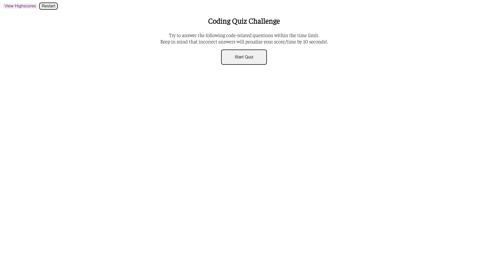
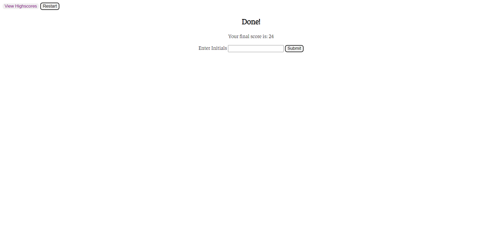
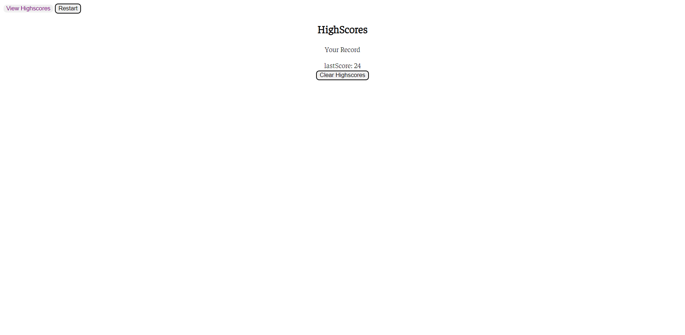

# Javascript Code Quiz

## Description

This project is a code quiz application covering fundamental JavaScript topics.
It was created using HTML5 CSS and JavaScript.

## Screenshots

### Home Page

### Submit and Save Page

### Highscore Page

## Usage
1. Click "Start Quiz".
2. Timer on the top right will start to run.
3. Total time is 60 seconds with 8 questions in total.
4. The "View HighScores"  on the top left will direct the user to view all current high scores.
5. A series of questions are presented with multiple choice answers:
- If the question is answered wrong, 10 seconds will be deducted to the timer.
6. When all questions are answered or the timer reaches 0, the quiz is over.

7. When thre quiz is over, the user can enter the initials , click "Submit" to save to high scores to local storage. Then it will show a list of saved high scores

8. The user then will have the option to click on "Restart" to start quiz again, or "Clear HighScores" to clear saved scores.

## Link to deployed application

[Deployed application](https://eduardbahrin.github.io/code-quiz/)

## Link to GitHub repository

[Github repository](https://github.com/eduardbahrin/code-quiz)

